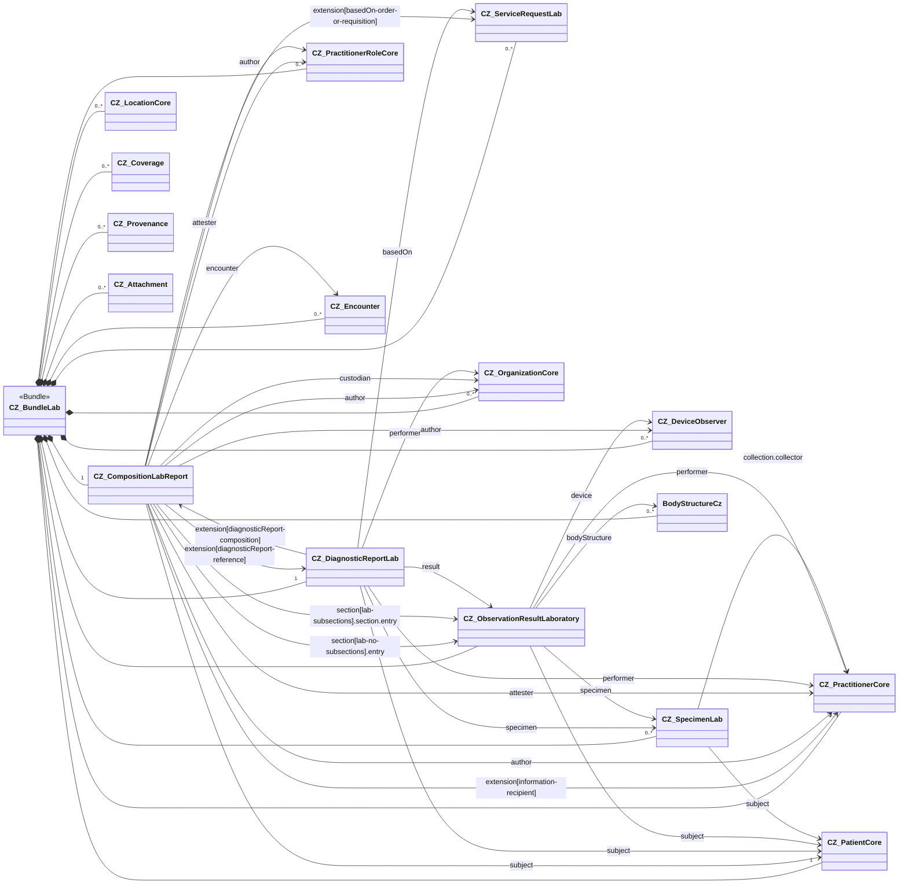

Na následující stránce najdete poznámky k implementaci laboratorní zprávy. Týkají se sestavení dokumentového bundle, jeho composition a vyplnění jednotlivých profilů příslušnými daty.

### Přehled obsahu

Zpráva je reprezentována jako FHIR Bundle typu `document`, který obsahuje resources `CZ_CompositionLabReport` a `CZ_DiagnosticReportLab` spolu se všemi resources dosažitelnými z composition (viz [$document operation](https://www.hl7.org/fhir/composition-operation-document.html)). Při implementaci je nutné dodržet závazná pravidla popsaná v sekci [Obligations](obligations-cs.html).

### Popis obsahu CZ_CompositionLabReport

`CZ_CompositionLabReport` je vstupní resource dokumentu laboratorní zprávy. Nese hlavičku dokumentu (subjekt, autor(y), ověřovatele, kustoda, typ dokumentu, jazyk, důvěrnost, encounter a zpětnou vazbu na příslušný `CZ_DiagnosticReportLab`) a organizuje laboratorní výsledky do jedné nebo více sekcí.

V těle dokumentu jsou podporovány dvě strukturní varianty, které mohou být v jedné zprávě i kombinovány:

- **Varianta 1 – `section[lab-no-subsections]` (plochá sekce)**: vrcholová sekce příslušné laboratorní odbornosti, která přímo obsahuje jak narativní text (`section.text`), tak strojově čitelné `entry` odkazy na instance `CZ_ObservationResultLaboratory`. Další podsekce nejsou povoleny.
- **Varianta 2 – `section[lab-subsections]` (strukturovaná sekce)**: vrcholová sekce laboratorní odbornosti, která sama nenese text ani entries, ale sdružuje několik listových podsekcí (typicky podle baterie, typu vzorku či jednotlivého vyšetření). Každá listová podsekce nese vlastní narativní text a `entry` odkazy na `CZ_ObservationResultLaboratory`.
- **`section[annotations]` (sekce poznámek, fixní kód LOINC `48767-8`)**: nepovinná čistě narativní sekce určená pro laboratorní komentáře, technické poznámky, odkazy na akreditace apod. Nesmí obsahovat `entry` ani podsekce.

Kódy sekcí v obou variantách jsou (preferred) vázány na value set `CZ_LabStudyTypesVS` (laboratorní odbornosti).

### Popis obsahu CZ_DiagnosticReportLab

`CZ_DiagnosticReportLab` reprezentuje samotnou laboratorní výsledkovou zprávu (klinické/diagnostické sdělení) a je konceptuálním protějškem dokumentového Composition. V dokumentovém Bundle laboratorní zprávy se vyskytuje právě jednou a musí být dosažitelný z Composition skrze extension `diagnosticReport-reference`. Naopak `CZ_DiagnosticReportLab` odkazuje na Composition skrze extension `diagnosticReport-composition` (zarovnání R5 do R4).

Nese:

- `identifier` zprávy (shoduje se s identifierem Composition),
- `status` zprávy a `category`/`code` (konzistentní s `type`/`category` Composition),
- `subject` (stejný pacient jako v Composition) a `encounter`,
- žádanku v `basedOn` (`CZ_ServiceRequestLab`),
- odkazy na analyzované vzorky `specimen` (`CZ_SpecimenLab`),
- odkazy na vytvořené výsledky `result` (`CZ_ObservationResultLaboratory`),
- `performer` zprávy (laboratorní pracovník / organizace) a případně `resultsInterpreter`,
- časy platnosti (`effective[x]`) a vydání zprávy (`issued`).

### Popis obsahu CZ_ObservationResultLaboratory

`CZ_ObservationResultLaboratory` reprezentuje jeden laboratorní nález (výsledek). Jedna zpráva typicky obsahuje řadu těchto observací organizovaných do sekcí podle laboratorní odbornosti. Profil je cílem konformity každé `entry` v laboratorních sekcích a každého `result` referovaného z `CZ_DiagnosticReportLab`.

Nese:

- `code` testu (LOINC a/nebo NČLP – viz [Terminology considerations](terminology-considerations-cs.html)),
- výsledek `value[x]` nebo `dataAbsentReason`,
- `interpretation`, `referenceRange`, `note`,
- `subject`, případný `specimen` (`CZ_SpecimenLab`), případný `performer` a měřící `device` (`CZ_DeviceObserver`),
- časování (`effective[x]`, `issued`) a `status`,
- strukturované komponenty v `component` u baterií / panelů reportovaných jako jedna observace.

### Popis obsahu CZ_SpecimenLab

`CZ_SpecimenLab` reprezentuje biologický vzorek odebraný pacientovi a analyzovaný v laboratoři. Vzorky jsou odkazovány z `CZ_DiagnosticReportLab.specimen` a tam, kde je to relevantní, i z `CZ_ObservationResultLaboratory.specimen`.

Nese:

- `type` vzorku (preferred binding na český value set typů vzorků, sekundární HL7 v2-0487 kódy jsou povoleny jako mapování),
- `subject` (pacient),
- detaily odběru: `collection.collectedDateTime`/`collectedPeriod`, `collection.bodySite` (případně referenci na `BodyStructureCz`), `collection.method`, `collection.collector`,
- nádobu, zpracování a `receivedTime` v laboratoři.

### Popis obsahu CZ_ServiceRequestLab

`CZ_ServiceRequestLab` reprezentuje laboratorní žádanku, která vyšetření iniciovala. Je odkazována z Composition skrze `extension[basedOn-order-or-requisition]` a z `CZ_DiagnosticReportLab.basedOn`.

Nese:

- `identifier` žádanky (placer / filler),
- `code` požadovaného vyšetření (LOINC / NČLP),
- `subject`, `encounter` a `requester`,
- `priority`, `authoredOn`, klinický kontext (`reasonCode`/`reasonReference`) a případně referenci na vzorek.

### Vyplnění účastníků

- **`author`** Composition je typicky laboratorní pracovník, který zprávu finalizoval (`CZ_PractitionerCore` / `CZ_PractitionerRoleCore`), a/nebo vydávající analyzátor (`CZ_DeviceObserver`).
- **`attester`** typicky obsahuje právního ověřovatele zprávy (`mode = legal`) a/nebo validátora výsledků (`mode = professional`).
- **`custodian`** je laboratorní organizace (`CZ_OrganizationCore`) odpovědná za uchovávání zprávy.
- **`information-recipient`** uvádí žádajícího klinika a další případné příjemce zprávy.
- **`performer`** v `CZ_DiagnosticReportLab` a v jednotlivých `CZ_ObservationResultLaboratory` identifikuje toho, kdo skutečně provedl vyšetření nebo podepsal jednotlivý výsledek.
