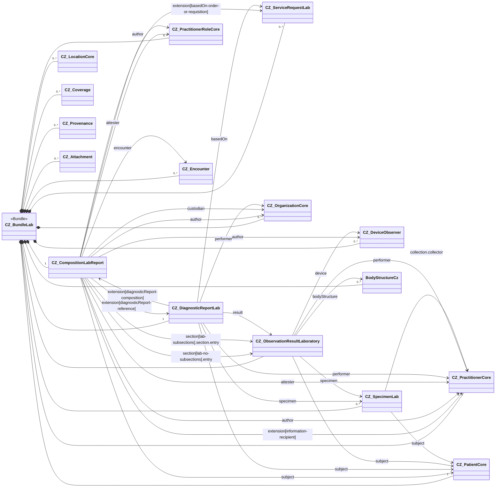

On the following page, you will find notes on implementing the laboratory report. They concern the creation of the bundle, its composition and filling these profiles with the relevant data.

### Contents overview

The report is represented as a FHIR Bundle of type `document` that contains the resources `CZ_CompositionLabReport` and `CZ_DiagnosticReportLab` together with all resources reachable from the composition (see [$document operation](https://www.hl7.org/fhir/composition-operation-document.html)). When implementing, it is necessary to follow the binding rules described in the [Obligations](obligations-en.html) section.

### Description of content CZ_CompositionLabReport

`CZ_CompositionLabReport` is the entry resource of the laboratory report document. It carries the document header (subject, author(s), attester(s), custodian, document type, language, confidentiality, encounter and the back-reference to the corresponding `CZ_DiagnosticReportLab`) and organizes the laboratory results into one or more sections.

Two structural variants of the body are supported and may coexist within one report:

- **Variant 1 – `section[lab-no-subsections]` (flat section)**: a top-level laboratory specialty section that directly contains both the human-readable narrative (`section.text`) and the machine-readable `entry` references to `CZ_ObservationResultLaboratory` instances. No further sub-sections are allowed.
- **Variant 2 – `section[lab-subsections]` (structured section)**: a top-level laboratory specialty section that contains no narrative or entries of its own, but groups several leaf sub-sections (typically per battery, specimen study or individual test). Each leaf sub-section carries its own narrative and `entry` references to `CZ_ObservationResultLaboratory`.
- **`section[annotations]` (annotation section, fixed code LOINC `48767-8`)**: optional narrative-only section dedicated to laboratory comments, technical notes, accreditation references etc. It SHALL NOT contain `entry` or sub-sections.

The section codes in both variants are bound (preferred) to the `CZ_LabStudyTypesVS` value set (laboratory specialties).

### Description of content CZ_DiagnosticReportLab

`CZ_DiagnosticReportLab` represents the laboratory result report itself (the clinical/diagnostic statement) and is the conceptual counterpart of the document Composition. In the laboratory document Bundle it occurs exactly once and SHALL be reachable from the Composition through the extension `diagnosticReport-reference`. Conversely, `CZ_DiagnosticReportLab` references the Composition through the extension `diagnosticReport-composition` (R5 alignment for R4).

It carries:

- the report `identifier` (matches the Composition identifier),
- the report `status` and `category`/`code` (consistent with the Composition `type`/`category`),
- the `subject` (same patient as in the Composition) and the `encounter`,
- the requesting order(s) in `basedOn` (`CZ_ServiceRequestLab`),
- the analyzed `specimen` references (`CZ_SpecimenLab`),
- the produced `result` references (`CZ_ObservationResultLaboratory`),
- the `performer` of the report (laboratory practitioner / organization) and any `resultsInterpreter`,
- effective times (`effective[x]`) and `issued` time of the report.

### Description of content CZ_ObservationResultLaboratory

`CZ_ObservationResultLaboratory` represents a single laboratory finding (result). One report typically contains many such observations, organized into sections by laboratory specialty. The profile is the conformance target of every `entry` in laboratory sections and of every `result` referenced from `CZ_DiagnosticReportLab`.

It carries:

- the test `code` (LOINC and/or NČLP – see [Terminology considerations](terminology-considerations-en.html)),
- the result `value[x]` or `dataAbsentReason`,
- `interpretation`, `referenceRange`, `note`,
- the `subject`, optional `specimen` (`CZ_SpecimenLab`), optional `performer` and observing `device` (`CZ_DeviceObserver`),
- the timing (`effective[x]`, `issued`) and `status`,
- structured components in `component` for batteries / panels reported as a single observation.

### Description of content CZ_SpecimenLab

`CZ_SpecimenLab` represents a biological specimen taken from the patient and analysed in the laboratory. Specimens are referenced from `CZ_DiagnosticReportLab.specimen` and, where relevant, from `CZ_ObservationResultLaboratory.specimen`.

It carries:

- the `type` of the specimen (preferred binding to the CZ specimen type value set, secondary HL7 v2-0487 codes are allowed as a mapping),
- the `subject` (patient),
- collection details: `collection.collectedDateTime`/`collectedPeriod`, `collection.bodySite` (or `BodyStructureCz` reference), `collection.method`, `collection.collector`,
- container, processing and the `receivedTime` in the laboratory.

### Description of content CZ_ServiceRequestLab

`CZ_ServiceRequestLab` represents the laboratory order/requisition that initiated the testing. It is referenced by the Composition through `extension[basedOn-order-or-requisition]` and by `CZ_DiagnosticReportLab.basedOn`.

It carries:

- the order `identifier` (placer / filler),
- the requested test(s) `code` (LOINC / NČLP),
- the `subject`, `encounter` and `requester`,
- the `priority`, `authoredOn`, clinical context (`reasonCode`/`reasonReference`) and any specimen reference.

### Filling the participants

- **`author`** of the Composition is typically the laboratory practitioner who finalized the report (`CZ_PractitionerCore` / `CZ_PractitionerRoleCore`) and/or the issuing analyzer (`CZ_DeviceObserver`).
- **`attester`** typically holds the legal authenticator of the report (`mode = legal`) and/or a result validator (`mode = professional`).
- **`custodian`** is the laboratory organization (`CZ_OrganizationCore`) responsible for storing the report.
- **`information-recipient`** lists the requesting clinician(s) and any other recipients of the report.
- **`performer`** on `CZ_DiagnosticReportLab` and on individual `CZ_ObservationResultLaboratory` instances identifies who actually carried out the testing or signed off the individual result.
